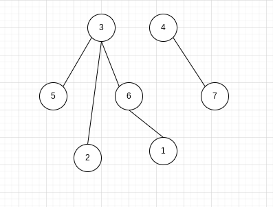
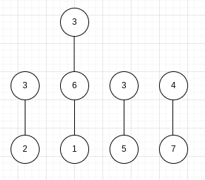
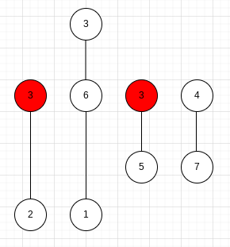
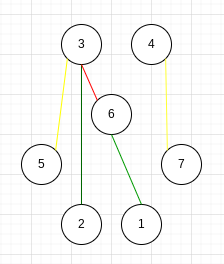

<h2>Layering</h2>
<h3>Handling</h3>
<h4>Properties</h4>
<ul>
    <li> <h5> Core </h5>
        <ul> 
            <li> No tos from outputs</li>
            <li> No froms to inputs</li>
        </ul>
    </li>
    <li> <h5> Components </h5>
        <ul> 
            <li> "Components" should be connectable<br>to any neurons except inputs</li>
        </ul>
    </li>
</ul>
<hr>
<br>


<h3>Example</h3>
<h4>Get all non dependant neurons</h4>

```rust
let mut non_dependant: Vec<usize> = vec![]

for neuron in network.neurons {
    if neurons.from_arr.len() == 0 {
        non_dependant.push(neuron.id);
    }
}
```

In this case that would be-
```rust
[1, 2, 5, 7]
```

Using the example it would give- 
<br>



To then get the layers, you could just<br> delete any neurons that have been seen before<br>
then slip the outputs upone
<br>
<br>
This would give-



Or 
```rust
[
    [ 3 ],
    [ 4, 6 ],
    [ 5, 7 ],
    [ 2, 1 ],
]
```

If we model this in the original network <br>
we can check if it is correct

Modled Network-
<br>



<hr>